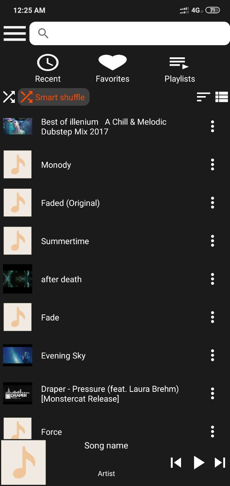
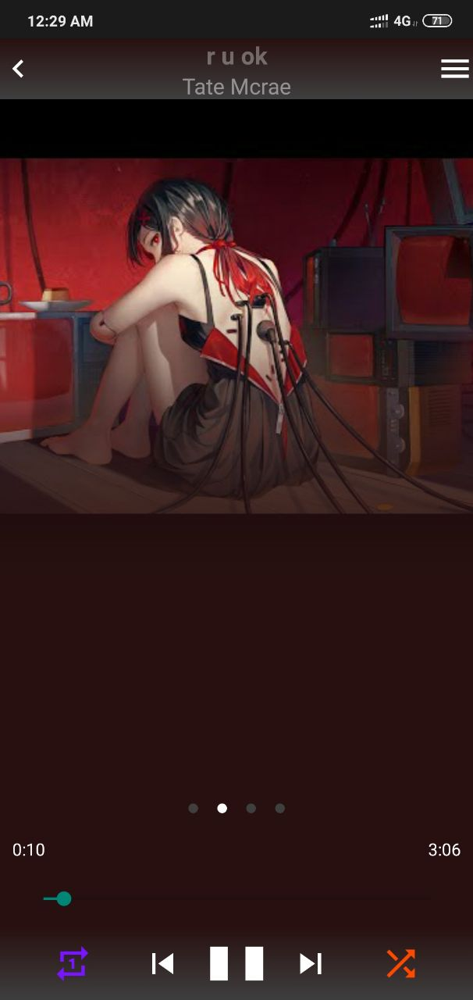
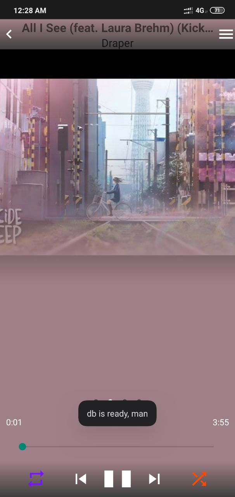
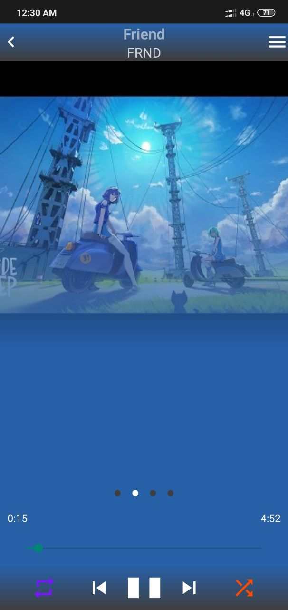
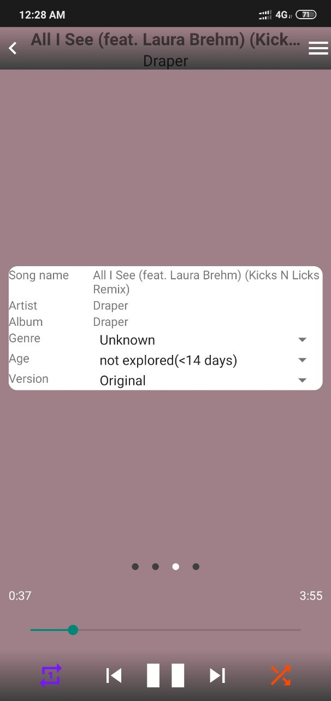
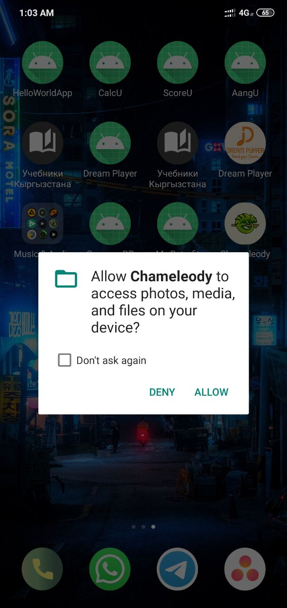
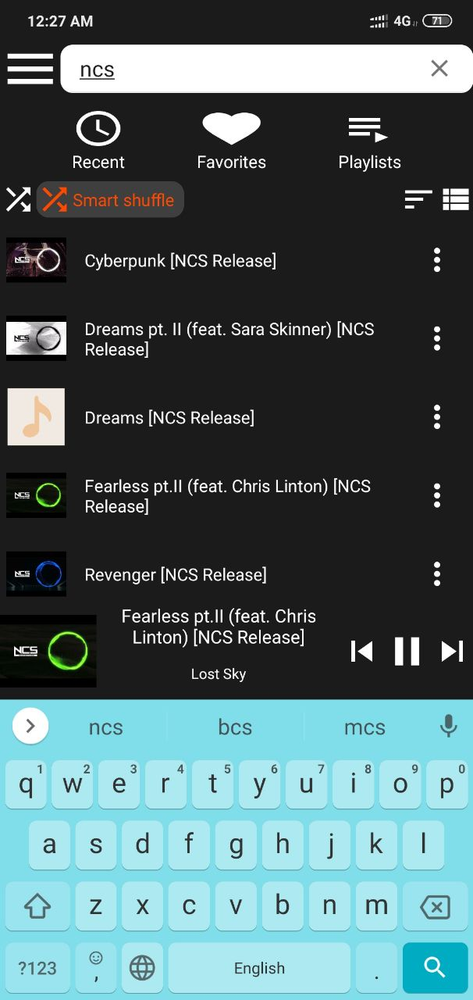
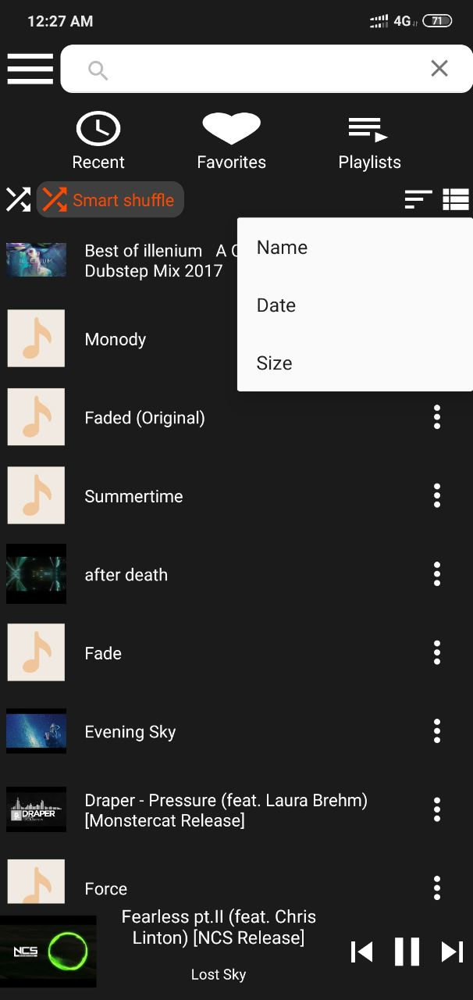
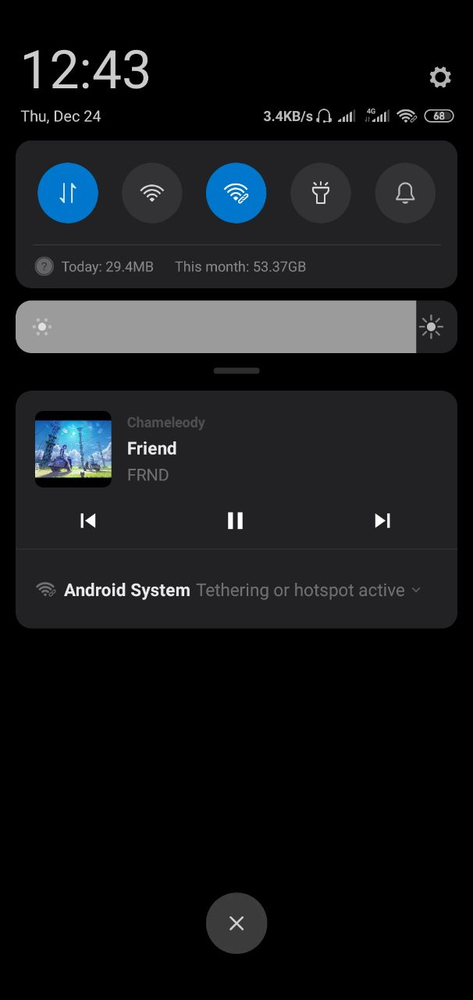
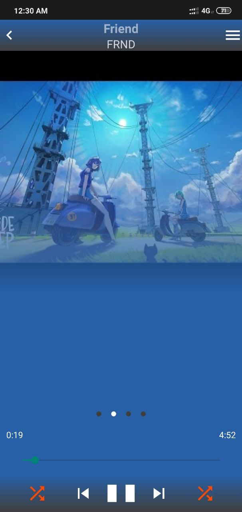

Chameleody: Music Player with most features which other music players have and more features that other music players don't have. I haven't finished it yet. But, It is enough ready to use.

Final Project requirements:  
Link to a repository (30 pts max)✅  
Use of data storage (DB, Cloud or SharedPreferences) (20 pts max)✅ SharedPreferences, Room. (Also Firebase will be added, now there is only json file)  
Design and representation (figma design first is welcome) (20 pts max)✅ [link](https://www.figma.com/file/5z4MmlFdfMtPN0hO2KZBKG/Chameleody?node-id=0%3A1)  
Wise use of libraries and frameworks (20 pts max)✅ [gradle](https://github.com/DOSLAN/Chameleody/blob/main/app/build.gradle) Glide; Room; Coroutines; Lifecycle, Palette and Media from androidx  
Clean code (10 pts max)❌  
BONUS POINTS FOR (20 pts):  
Projects related to our University❌  
Projects which use Dagger, Glide other tools✅ Used Glide for all cover art displays and getting a palette of cover art in the player window
Submit link to repository:  
commit history elder than 1 week (10 pts)✅  
apk in releases (5 pts)✅ will be  
screenshots, name and short description (15 pts)✅ will be  

## Screenshots of UI
<table>
  <tr>
    <td>Main window</td>
    <td>Player window</td>
  </tr>
  <tr>
    <td></td>
    <td></td>
  </tr>
 </table>

<table><tr><td>UI colors of Player will change according to song's art's color</td></tr></table>
<table>
 <tr>
  <td></td>
  <td></td>
  <td></td>
 </tr>
</table>

<table><tr><td>Player has four tabs</td></tr></table>
<table>
  <tr>
    <td>Lyrics</td>
    <td>Cover art</td>
    <td>General info</td>
    <td>Mood classification</td>
  </tr>
 <tr>
  <td></td>
  <td></td>
  <td></td>
  <td></td>
 </tr>
</table>
 
 ## Screenshots of misc capabilities
 
<table>
 <tr>
  <td> App icon </td>
  <td> Logo </td>
  <td> Asking for permission </td>
 </tr>
 <tr>
  <td></td>
  <td></td>
  <td></td>
 </tr>
</table>

<table>
 <tr>
  <td> Searching songs</td>
  <td> Sorting songs list</td>
  <td> Notification </td>
 </tr>
 <tr>
  <td></td>
  <td></td>
  <td></td>
 </tr>
</table>

<table><tr><td>Player has four shuffle types, on the left of play button, on the right new feature which has not implemented</td></tr></table>
<table>
  <tr>
    <td>Repeat one, when next or prev pressed it will work like a Repeat All</td>
    <td>Repeat All</td>
    <td>Shuffle All</td>
    <td>Smart shuffle, this one doesn't implemented yet. It is one of the original features</td>
  </tr>
 <tr>
  <td></td>
  <td></td>
  <td></td>
  <td></td>
 </tr>
</table>
